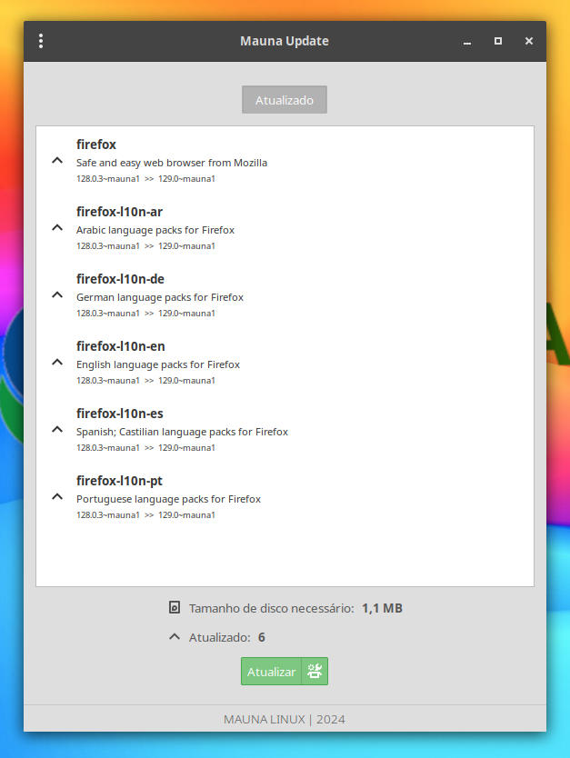

# Mauna Update

Mauna Update is a simple system update application written in GTK and python.

It is currently a work in progress. Maintenance is done by <a href="https://maunalinux.top/">Mauna</a> team.

### **Dependencies**

This application is developed based on Python3 and GTK+ 3. Dependencies:
```bash
dh-python python3-all python3-setuptools
```

### **Run Application from Source**

Install dependencies
```bash
sudo apt install dh-python python3-all python3-setuptools
```
Clone the repository
```bash
git clone https://github.com/maunalinux/mauna-update.git ~/mauna-update
```
Run application
```bash
python3 ~/mauna-update/src/Main.py
```

### **Build deb package**

```bash
sudo apt install devscripts git-buildpackage
sudo mk-build-deps -ir
gbp buildpackage --git-export-dir=/tmp/build/mauna-update -us -uc
```

### **Screenshots**



